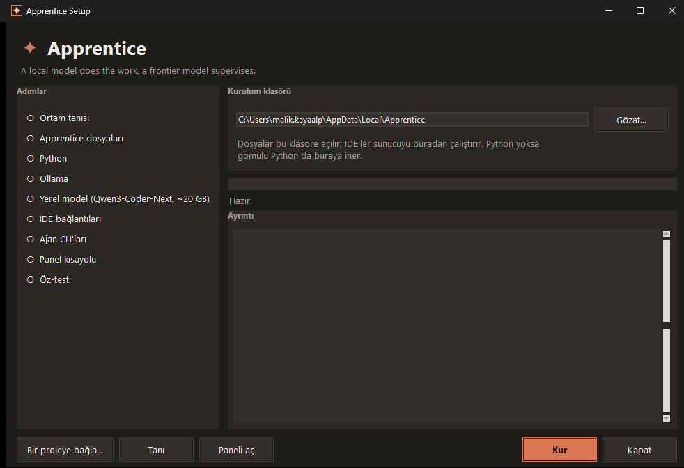

# Apprentice

**A local model does the work, a frontier model supervises.**

A local coding model (Ollama, Qwen3-Coder-Next) does the work: it writes files, calls tools, runs
tests and repairs its own errors. A frontier model — the one already in your IDE (Cursor, Claude
Code, VS Code) — supervises: it writes the task and the **acceptance criteria**, reads the raw
measurements that come back, and decides when the work is done. Your code never leaves the machine
and the worker burns no API tokens; the supervisor only ever sees summaries and measurements.

*Apprentice* is **Çırak** in Turkish. The master watches, the apprentice works.

## Why this split (measured, not assumed)

- Same worker, same task: asked to interpret its **own** raw measurement and fix itself, it never
  converged (closest distance 1.15 → 0.01). Given the same measurement **summarised** — "this rule
  does not hold, you need a hard constraint" — it solved it in two rounds.
- Six-task code campaign with hidden supervisor checks (never shown to the worker): **34/36** on
  round one, 36/36 after concrete supervisor feedback. One task that generic feedback ("the tests
  fail") could not fix in 2×1000 s was fixed in **130 s** by a concrete one-paragraph diagnosis.
- When the criteria are numbers from the start, the worker writes on its own the pattern that
  otherwise has to be taught to it afterwards.

Evidence and every experiment live in [apprentice-lab](https://github.com/malikkayaalp/apprentice-lab).

## Install

**Windows — no Python required.** Download `Apprentice-Setup.exe` from
[Releases](https://github.com/malikkayaalp/apprentice/releases) and run it from anywhere. You pick
the install folder; the setup then checks and completes, step by step: Python (downloads an embedded
runtime if missing) → Ollama (starts it, or points you to the download) → the model (sized to your
RAM, with a progress bar) → an `apprentice` MCP entry for every installed IDE (Cursor, VS Code,
Windsurf; other entries are left untouched) → a self-test.



**macOS / Linux / manual:** Python 3.10+ and `python kur.py` (same engine, no third-party packages).

## Watch it work

The setup installs **Apprentice WebPanel** — a native window (WebView2, no browser chrome, no
Electron) that shows the apprentice working in real time: the event stream, the files it writes,
the pipeline, the metrics, and a **diff view** of every version of every file it touched. You can
also talk to both models from it — free-form chat with the local apprentice, and with Claude as
the supervisor. See [Panel](#panel) below.

## Use

Add the supervisor rule to your project (`python kur.py --kural <project>`), then simply describe the
task in your IDE chat. The frontier model writes concrete criteria, calls `worker_run`, the local
model writes and tests the code, and the frontier model verifies the result against the raw
measurements. You never type a path: the worker is confined to the workspace root your IDE reports
over MCP `roots`.

Tools, return schema and rules: [server/README.md](server/README.md).
Unity support is a separate, optional repo: [apprentice-unity](https://github.com/malikkayaalp/apprentice-unity).

---

# Türkçe

Yerel bir kodlama modeli (Ollama, Qwen3-Coder-Next) işi yapar: dosya yazar, araç çağırır,
test koşar, hatayı düzeltir. Büyük bir model (IDE'nizdeki Claude/GPT/Gemini ya da Claude Code)
denetler: görevi kabul kriterleriyle verir, dönen ölçümü yorumlar, ne zaman durulacağına karar
verir. Kod dışarı çıkmaz, kota yoktur; denetçiye yalnızca özetler ve ölçümler gider.

Türkçede *Çırak*. Usta bakar, çırak yapar.

## Neden bu bölünme (ölçüldü)

- Aynı işçi, aynı görev: ham ölçümü kendisi yorumlayıp düzeltmeye kalkınca yakınsamadı; ölçüm
  **özetlenip** "şu kural tutmuyor" diye verilince 2 turda çözdü.
- 6 görevlik kod kampanyası (gizli denetçi kontrolleri): tur-1 34/36 → denetçinin somut geri
  bildirimiyle 36/36. Genel geri bildirim ("test tutmuyor") 2×1000 sn'de çözemediğini, somut özet
  130 sn'de çözdü.
- Kriterler baştan sayıyla verilince işçi sonradan öğretilmesi gereken deseni kendiliğinden kurdu.

Kanıtlar ve bütün deneyler [apprentice-lab](https://github.com/malikkayaalp/apprentice-lab) deposunda.

## Panel

Kurulum masaüstüne **Apprentice Panel** kısayolu bırakır; kısayol `Apprentice-WebPanel.exe`'yi
açar. Tarayıcı değil, **kendi penceresi** (WebView2; Electron yok, ek bağımlılık yok). Panel çırağı iş üstünde
gösterir ve iki modelle de konuşmanızı sağlar.

**Sekiz bölüm:** İŞLER · BORU HATTI · OLAY AKIŞI · ÇIRAK · METRİKLER · İŞ ÖZETİ ·
USTA·CLAUDE · DOSYALAR

**Yerleşim.** Paneller 24×24'lük bir ızgaraya oturur ve **çerçevenin dışına taşmaz**. Bir paneli
başka bir panelin üstüne sürüklerseniz alttaki küçülmez — itilir, yer değiştirir ya da rafa iner.
Yedi hazır dizilim vardır (Dengeli · Kodu izle · Sohbet · Denetim · Odak: çırak · Odak: usta ·
Dar ekran) ve kendi düzeniniz kaydedilir.

**Dışarı alma.** Her panel kendi **çerçevesiz** penceresine çıkabilir: kapatma/taşıma/büyütme
düğmeleri bizimdir, "hep üstte" seçeneği vardır, yeniden boyutlandırılır. Dosya görüntüleyici de
ayrı bir penceredir — kod, panel alanını kaplamaz.

**Fark (diff) görünümü.** Denetleyenin sorusu "ne yazdı" değil **"ne değiştirdi"**dir. Aynı dosya
onarım turlarında birkaç kez yazılır; her yazım bir **sürümdür**. Görüntüleyicideki `± fark`
düğmesi iki sürüm arasındaki değişikliği gösterir: yeşil `+` / kırmızı `−` satırlar, `+18 −9`
özeti, değişmeyen uzun bloklar katlanmış. Sürüm seçiciden herhangi bir turu açabilirsiniz.

**Model kapsülü** (sağ üst). Çırak modeli oradan seçilir — görev kutusundaki seçiciyle aynı
seçimdir. `▶` seçili modeli önceden ısıtır, `⏏` bellekten boşaltır. Model yüklemesi 30–60 sn
sürdüğü için kapsül **ışık verir**: sarı nabız, dönen düğme, saniye sayacı; model gerçekten
yüklendiğinde yeşil parlar. Ollama'nın kaydında görünmeyip RAM tutan **öksüz süreçler** de
burada uyarı olarak çıkar ve tek tıkla temizlenir (ölçüldü: 13 GB geri alındı).

**İki sohbet.** ÇIRAK bölümünde yerel modelle serbest sohbet edilir (görev kalıbı yok, hafızalı);
USTA bölümü Claude Code CLI'yı kullanır. Kod blokları açılıp kapanır ve kopyalanır, her balonun
kendi kopyala düğmesi vardır. İstersen sohbet bağlamını göreve taşıyabilirsin (varsayılan kapalı).

Elle açmak: `python panel_ac.py` — ya da yalnız sunucu: `python clients/web/panel.py --port 8788`

## Yapı

```
server/            MCP sunucusu: worker_run(görev, kabul_kriterleri, ortam) — bkz. server/README.md
kur.py             kurulum motoru (Windows'ta Apprentice-Setup.exe olarak paketlenir)
kur_gui.py         kurulum penceresi (adım adım, Tanı düğmesi, çökme günlüğü)
core/              Ollama istemcisi, şema koruması, ayar yükleyici, ilk-çalıştırma ölçümü
core/tani.py       ortam tanısı: Ollama/port/model/disk/RAM/izin kontrolleri, öksüz süreç avı
mcpbridge/         MCP taşıma (stdio + Streamable HTTP), bağımlılıksız; test için fake_server
envs/code/         kod ortamı: dosya oku/yaz, shell, test; workspace'e hapis; compile()+unittest/pytest
envs/fake/         duman testi ortamı (model gerektirmez)
envs/<eklenti>/    eklentiler buraya klonlanır ve otomatik keşfedilir (örn. apprentice-unity)
clients/web/panel.py         panel sunucusu (stdlib; ek paket yok)
clients/web/panel.html       panel arayüzü (tek dosya, derleme adımı yok)
clients/web/goruntuleyici.py dosya görüntüleyici + sürüm/fark motoru (stdlib difflib)
shell/ApprenticePanel/       WebView2 kabuğu (C#) — Apprentice-WebPanel.exe
panel_ac.py        paneli açar (kabuk varsa onunla, yoksa tarayıcıyla)
tests/             sözleşme testleri, kod ortamı testi, ölçüm kampanyaları
```

## Gereksinimler

- [Ollama](https://ollama.com) (kurulum betiği modeli kendisi indirir; elle: `ollama pull hf.co/unsloth/Qwen3-Coder-Next-GGUF:UD-Q4_K_XL`, ~20 GB)
- Python 3.10+ — Windows'ta gerekmez (kurulum gömülü Python indirir); ek paket yok

## Kurulum

**Windows (Python gerekmez):** [Releases](https://github.com/malikkayaalp/apprentice/releases) sayfasından
**`Apprentice-Setup.exe`**'yi indir ve çalıştır — her yerden çalışır, depoyu ayrıca indirmen gerekmez
(dosyalar exe'nin içinde; kurulum klasörünü sen seçersin, varsayılan `%LOCALAPPDATA%\Apprentice`).


Adım adım: Python (yoksa gömülü Python'u indirir) → Ollama (yoksa yönlendirir, kapalıysa başlatır) → model
(yoksa ilerleme yüzdesiyle indirir) → kurulu IDE'lerin MCP ayarına `apprentice` girdisi
(Cursor, VS Code, Windsurf; diğer girdilere dokunmaz) → öz-test → masaüstüne panel kısayolu.

**macOS / Linux / elle:** Python 3.10+ ile aynı betik:

```bash
python kur.py            # kurulum
python kur.py --kontrol  # yalnızca durum
python kur.py --tani     # ortam tanısı (aşağıya bakın)
python kur.py --ide cursor,vscode,windsurf,claude-desktop
python kur.py --olc      # + makineye özel num_batch ölçümü (2–3 dk; ölçüldü: 512 → 4096 arası +%342 prefill)
python kur.py --kural <proje>   # projeye denetçi kuralı (.cursor/rules/apprentice.mdc + APPRENTICE.md)
```

Claude Code: depodaki `.mcp.json` otomatik görülür. Kurulumdan sonra IDE'nin MCP listesinde `apprentice`
yeşil olmalı; araçlar `worker_run`, `worker_status`.

Kullanım: projene kural dosyasını yaz (`--kural`), sohbette görevi ver — usta model kriter yazar,
`worker_run`'ı çağırır, yerel model yazar/test eder, usta sonucu doğrular. Yol yazmana gerek yok:
işçi IDE'nin bildirdiği workspace köküne hapsedilir (MCP `roots`). Araçlar, dönüş şeması ve kurallar:
[server/README.md](server/README.md).

## Eklentiler

Ortamlar `envs/<ad>/env.json` ile keşfedilir; çekirdek yalnızca `code` içerir. Oyun motoru gibi
alanlar ayrı depolardır ve `envs/<ad>` olarak klonlanır:

- [apprentice-unity](https://github.com/malikkayaalp/apprentice-unity) — Unity araç seti + derleme/play
  doğrulaması + Q3CNFU Editor paneli. Klonlanınca `worker_run`'da `ortam="unity"` belirir.

## Ölçülmüş tasarım kararları

- Başarı **doğrulayıcıyla** (derleyici, test) belirlenir, modelin beyanıyla değil; `ozet` beyandır.
- Ölçüm ham döner, yorum denetçide; işçi ölçüm-düzeltme döngüsüne sokulmaz (`araclar_kapali`).
- Silme aracı yok; `run_shell`'de silme ve `git push` reddedilir.
- İşçi ayrık süreç; istemci iptal ederse öldürülür (Cursor'ın ~150 sn zaman aşımı ölçüldü →
  `bekle=false` + `worker_status`).
- Araç bloğu küçük ve sabit tutulur: her turda yeniden gönderilir, kullanılmayan araç kalıcı vergidir.
- Yazma anında derleme + ruff: hata bir sonraki tura değil, **aynı** tura döner.
- `yazilabilir` listesi (−%94 token), `dogrulama=derleme` (−%55), canlı kip (−%31 istem).

## Test

```bash
python tests/test_server.py        # model gerekmez
python tests/test_panel.py         # panel + görüntüleyici sözleşmeleri (20 kontrol)
python tests/test_tani.py          # 11 arıza senaryosu, simüle
python tests/test_code_env.py      # kod ortamı; --live ile gerçek görev
python tests/code_kampanya.py      # 6 görevlik ölçüm kampanyası (Ollama gerekir)
```

Testler **sözleşme** testidir: uç ↔ arayüz bağları, id bütünlüğü, yerleşim motoru, ışık durum
makinesi ve sözdizimi vurgulayıcısı gerçekten koşturularak denetlenir. Her yeni test, hatayı
kasten geri koyarak **gerileme testinden** geçirilir — yakalamayan test yazılmaz.

## Bir şey çalışmıyorsa: önce TANI

Kurulum takıldıysa, panel açılmadıysa ya da çırak koşmuyorsa tahmin etmeyin — sistem size
tam olarak neyin eksik olduğunu ve ne yapmanız gerektiğini söyler:

```
python kur.py --tani
```

Kurulum penceresindeki **Tanı** düğmesi aynı raporu verir (panoya kopyalanabilir).
Panelde de `/api/tani` ucundan alınabilir.

Tanının kapsadığı gerçek durumlar:

| Durum | Ne olur |
|---|---|
| Ollama kurulu değil | İndirme bağlantısı verilir; kurulum durur (yarım kurulum bırakmaz) |
| Ollama kurulu ama PATH'te değil | Bulunduğu yer gösterilir, kurulum yine de çalışır |
| Ollama çalışmıyor | Kurulum başlatmayı dener; elle komut da söylenir |
| 11434 portunu başka program tutuyor | Ayrı port + `ollama.url` ayarı anlatılır |
| Model indirilmemiş | `ollama pull ...` komutu; makinede benzer model varsa listelenir |
| Model klasörü başka diske taşınmış (`OLLAMA_MODELS`) | O diskin boş alanı ölçülür, yetmezse söylenir |
| Disk dolu | Kaç GB gerektiği ve modeli başka diske taşıma yolu |
| RAM/VRAM yetersiz | **Makineye uygun model otomatik seçilir** (aşağıya bakın) |
| Ollama kapatılınca RAM tutan öksüz süreç | Panelde uyarı çıkar, tek tıkla temizlenir (ölçüldü: 13 GB) |
| Kurulum klasörüne yazılamıyor | Başka klasör önerilir (Program Files gibi korumalı yerleri seçmeyin) |
| İnternet/proxy yok | Mevcut modelle çalışmaya devam edilir; `HTTPS_PROXY` hatırlatılır |
| Python eski | 3.10+ gerekir; Windows'ta Setup gömülü Python indirir |
| Panel portu (8788) dolu | Panel bir sonraki boş portu kendiliğinden kullanır |

### Donanıma göre model

Varsayılan model (Qwen3-Coder-Next 80B Q4, ~47 GB) güçlü makineler içindir. Kurulum
RAM'inizi ölçer ve kaldıramayacağınız bir modeli indirmeye **kalkışmaz**; onun yerine
uygun olanı seçer:

| RAM | Seçilen model | İndirme |
|---|---|---|
| 48 GB+ | Qwen3-Coder-Next 80B Q4 | ~47 GB |
| 24–48 GB | Qwen2.5-Coder 32B | ~20 GB |
| 12–24 GB | Qwen2.5-Coder 14B | ~9 GB |
| 12 GB altı | Qwen2.5-Coder 7B | ~5 GB |

Farklı bir model kullanmak isterseniz panelin sağ üstündeki **model kapsülünden** seçin; ayarlar
(bağlam penceresi, düşünme kipi, araç desteği) modelin kartına göre kendiliğinden uyarlanır.
GPU şart değildir — GPU yoksa CPU'da çalışır, yalnızca yavaştır.

### Sık karşılaşılanlar

- **"Kurulum bitti ama IDE'de apprentice görünmüyor"** — IDE'yi kapatıp açın; MCP listesini
  yenileyin. Ayar dosyanızda yorum satırı varsa kurulum ona dokunmaz ve size söyler.
- **"Panel açılmıyor"** — masaüstündeki *Apprentice Panel* kısayolu; açılmazsa hata penceresi
  sebebi gösterir. Elle: `python panel_ac.py`
- **"Claude ile konuşamıyorum"** — panelin USTA bölümü Claude Code CLI ister ve **ayrı giriş**
  gerekir (Claude Desktop girişi CLI'ya geçmez): `claude auth login`. Oturum süresi dolduysa
  panel bunu sarı balonla söyler ve yeniden giriş düğmesi verir. Çırak girişsiz çalışır.
- **"Model yavaş"** — ilk çağrıda model belleğe yüklenir (30–60 sn). Paneldeki `▶` ile önceden
  ısıtabilirsiniz; kapsüldeki sayaç ne kadar sürdüğünü gösterir.
