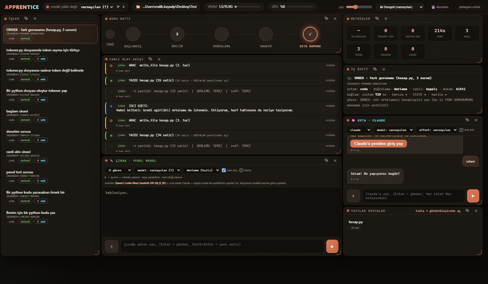
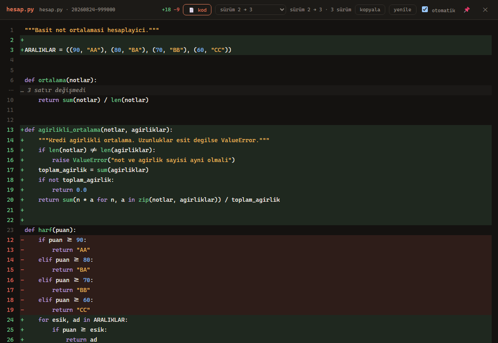

# Apprentice

**A local model does the work, a frontier model supervises.**

A local coding model (Ollama, Qwen3-Coder-Next) does the work: it writes files, calls tools, runs
tests and repairs its own errors. A frontier model — the one already in your IDE (Cursor, Claude
Code, VS Code) — supervises: it writes the task and the **acceptance criteria**, reads what came
back, and decides when the work is done. The worker burns no API tokens: the whole
write-verify-repair loop runs locally.

**What leaves the machine — stated precisely.** The worker never sends anything anywhere. The
*supervisor* is a different matter: if you supervise with a **remote** model (Claude, GPT, Gemini
in your IDE), then the **changed code is sent to that model** — by default a size-limited **diff**
of what the apprentice wrote, plus counts and verifier output. A diff is still source code, so we
do not claim "your code never leaves the machine": that is only true when you supervise with a
**local** model. Full file contents are **off by default** and only sent if you turn them on
explicitly (`"gizlilik": {"tam_icerik": true}`). Known secret formats (API keys, tokens, private
keys, password assignments, connection strings) are redacted before sending — pattern-based, so
treat it as a safety net, not a guarantee. Every report states what was sent in its `gizlilik`
field, so you never have to guess.

*Apprentice* is **Çırak** in Turkish. The master watches, the apprentice works.

## Why this split (measured, not assumed)

- Same worker, same task: asked to interpret its **own** raw measurement and fix itself, it never
  converged (closest distance 1.15 → 0.01). Given the same measurement **summarised** — "this rule
  does not hold, you need a hard constraint" — it solved it in two rounds.
- Six-task code campaign with hidden supervisor checks (never shown to the worker): **34/36** on
  round one, 36/36 after concrete supervisor feedback. One task that generic feedback ("the tests
  fail") could not fix in 2×1000 s was fixed in **130 s** by a concrete one-paragraph diagnosis.
- When the criteria are numbers from the start, the worker writes on its own the pattern that
  otherwise has to be taught to it afterwards.

Evidence and every experiment live in [apprentice-lab](https://github.com/malikkayaalp/apprentice-lab).

## Install

**Windows — no Python required.** Download `Apprentice-Setup.exe` from
[Releases](https://github.com/malikkayaalp/apprentice/releases) and run it from anywhere. You pick
the install folder; the setup then checks and completes, step by step: Python (downloads an embedded
runtime if missing) → Ollama (starts it, or points you to the download) → the model (sized to your
RAM, with a progress bar) → an `apprentice` MCP entry for every installed IDE (Cursor, VS Code,
Windsurf; other entries are left untouched) → a self-test.


**macOS / Linux / manual:** Python 3.10+ and `python kur.py` (same engine, no third-party packages).

## Watch it work

The setup installs **Apprentice WebPanel** — a native window (WebView2, no browser chrome, no
Electron) that shows the apprentice working in real time: the event stream, the files it writes,
the pipeline, the metrics, and a **diff view** of every version of every file it touched. You can
also talk to both models from it — free-form chat with the local apprentice, and with Claude as
the supervisor. See [Panel](#panel) below.



The diff view answers the question that actually matters when you supervise — not *what did it
write*, but **what did it change** between repair rounds:



## Use

Add the supervisor rule to your project (`python kur.py --kural <project>`), then simply describe the
task in your IDE chat. The frontier model writes concrete criteria, calls `worker_run`, the local
model writes and tests the code, and the frontier model verifies the result against the raw
measurements. You never type a path: file tools are confined to the workspace root your IDE reports
over MCP `roots`.

**Review, decide, undo.** Every job ends in a **ReviewSummary** — a stable projection the panel
reads instead of the raw event schema: what changed, what the verifier actually said, which
acceptance criteria were checked, and whether anything is still running. From there you
**ACCEPT** or **REJECT**, or hit **UNDO**. Undo shows a *plan* before it touches anything and
obeys three rules: files you had already modified before the job are never touched, files changed
*after* the job ended are never touched (that's your work, not the apprentice's), and it restores
file by file — never `git reset --hard`. If the workspace isn't a git repo *and* a shell command
ran, undo refuses and says why rather than guessing.

**Confinement, stated honestly.** `read_file`/`write_file` are jailed by path resolution.
`run_shell` runs a real OS shell, so it is screened by a command guard (absolute paths, `..`,
drive-relative, UNC and `~` are rejected) — a **guard, not a sandbox**: an interpreter that builds
a path at runtime can still get around it. That is why shell tools are off by default, and why the
git snapshot (not the event journal) is the primary undo path when they are on.

**Queue and policy — walk away while it works.** Stack tasks with the ⧗ button instead of
babysitting one at a time. The queue is **serial on purpose**: one local model, one GPU — two jobs
loading a model at once makes both slower and gets *less* done. If the panel dies mid-job, that job
is marked **interrupted, not re-run**: it may already have written files, and re-running would
overwrite them a second time. A **policy** decides what happens after each job — deterministically,
from the verifier's output, never from the model's own summary. It stops the queue on a failed
check, an out-of-scope write, or **stagnation** (the same error signature repeating across
attempts — measured: 2600 → 6050 tokens burned for an identical result). Auto-accept is **off by
default**: accepting is the supervisor's job, and this whole architecture exists because the
supervisor verifies *by running things*.

**Where the time went.** Every job draws a bar splitting its duration into *model generating* /
*tool running* / *verifying*, so speed work knows where to look. Older jobs recorded before
timestamps existed simply don't draw the bar — no estimates are invented to fill the gap.

**Measurement history in the panel.** Campaign runs are listed side by side — first-attempt score,
final score, duration — so "did this change improve anything?" has an answer on screen instead of
in a terminal. It only *reads*: measurement costs GPU-hours, so it is never triggered from a click.

**Live, not polled.** The panel gets a push notification when something changes (0.4 s instead of
up to 2 s). The stream carries *notification only* — the data still comes through the same,
already-tested fetch paths. Polling isn't removed, just slowed down; if the stream drops, it speeds
back up so the panel never dies quietly.

**Simple / Expert.** One toggle hides the advanced controls. It changes *visibility only* — the
hidden values are still sent, so a job started in Simple mode does exactly what it would in Expert.

**Settings that actually apply.** `apprentice.config.json` is read for real. Sampling values
(`temperature`, `think`, `num_predict`, `max_steps`, `retries`) and `prompt.ek_talimat` used to sit
in the template and be ignored at runtime — a silently ignored setting is worse than a missing one,
because you think you changed something. The safe defaults stay (`temperature: 0.0`, `think: false`
— both measured: `think` burned ~3900 reasoning tokens per task for no quality gain). You may change
them: nothing is blocked, but risky values raise a **warning with its reason**, and every job report
carries the **effective** values so "did my change apply?" is answered by record, not guesswork.
Campaigns run under a locked measurement profile so a benchmark stays single-variable.

**Truncation is no longer silent.** When a prompt exceeds the model's window Ollama does not reject
it — it *cuts* the prompt, and the model answers from a fragment. That is a "successful" job telling
a quiet lie. Truncation is now counted and surfaced: how many requests were cut, in which repair
rounds, and the largest prompt in a **single** request (kept separate from the per-job total —
"did it fit?" is a per-request question). The live/XML path gets the same check as the standard one.

**Unverified is not success.** If acceptance criteria were supplied but never checked, the result is
`dogrulanmadi` — not a pass. Auto-accept requires **positive evidence**, and the queue stops rather
than piling new work on an unverified foundation.

Tools, return schema and rules: [server/README.md](server/README.md).
Unity support is a separate, optional repo: [apprentice-unity](https://github.com/malikkayaalp/apprentice-unity).

---

# Türkçe

Yerel bir kodlama modeli (Ollama, Qwen3-Coder-Next) işi yapar: dosya yazar, araç çağırır,
test koşar, hatayı düzeltir. Büyük bir model (IDE'nizdeki Claude/GPT/Gemini ya da Claude Code)
denetler: görevi kabul kriterleriyle verir, döneni yorumlar, ne zaman durulacağına karar verir.
Çırak tarafında kota yoktur — yaz/doğrula/onar döngüsünün tamamı yerelde koşar.

**Makineden ne çıkar — açıkça.** Çırak hiçbir şeyi hiçbir yere göndermez. **Denetçi** ayrı bir
konudur: **uzak** bir modelle denetliyorsanız (IDE'nizdeki Claude/GPT/Gemini), **değişen kod o
modele gider** — varsayılan olarak çırağın yazdığının boyutu sınırlanmış **farkı**, artı sayımlar
ve doğrulayıcı çıktısı. **Fark da kaynak koddur**, bu yüzden "kod makineden çıkmaz" demiyoruz: bu
ifade yalnızca **yerel** bir denetçi kullandığınızda doğrudur. Dosyaların tam içeriği
**varsayılan olarak kapalıdır**, ancak açıkça açarsanız gider
(`"gizlilik": {"tam_icerik": true}`). Bilinen sır biçimleri (API anahtarı, jeton, özel anahtar,
parola ataması, bağlantı dizesi) gönderilmeden önce maskelenir — desen tabanlıdır, yani emniyet
ağı sayın, garanti değil. Her rapor `gizlilik` alanında ne gönderdiğini yazar; tahmin etmeniz
gerekmez.

Türkçede *Çırak*. Usta bakar, çırak yapar.

## Neden bu bölünme (ölçüldü)

- Aynı işçi, aynı görev: ham ölçümü kendisi yorumlayıp düzeltmeye kalkınca yakınsamadı; ölçüm
  **özetlenip** "şu kural tutmuyor" diye verilince 2 turda çözdü.
- 6 görevlik kod kampanyası (gizli denetçi kontrolleri): tur-1 34/36 → denetçinin somut geri
  bildirimiyle 36/36. Genel geri bildirim ("test tutmuyor") 2×1000 sn'de çözemediğini, somut özet
  130 sn'de çözdü.
- Kriterler baştan sayıyla verilince işçi sonradan öğretilmesi gereken deseni kendiliğinden kurdu.

Kanıtlar ve bütün deneyler [apprentice-lab](https://github.com/malikkayaalp/apprentice-lab) deposunda.

## Panel

Kurulum masaüstüne **Apprentice Panel** kısayolu bırakır; kısayol `Apprentice-WebPanel.exe`'yi
açar. Tarayıcı değil, **kendi penceresi** (WebView2; Electron yok, ek bağımlılık yok). Panel çırağı iş üstünde
gösterir ve iki modelle de konuşmanızı sağlar.


**Sekiz bölüm:** İŞLER · BORU HATTI · OLAY AKIŞI · ÇIRAK · METRİKLER · İŞ ÖZETİ ·
USTA·CLAUDE · DOSYALAR

**Yerleşim.** Paneller 24×24'lük bir ızgaraya oturur ve **çerçevenin dışına taşmaz**. Bir paneli
başka bir panelin üstüne sürüklerseniz alttaki küçülmez — itilir, yer değiştirir ya da rafa iner.
Yedi hazır dizilim vardır (Dengeli · Kodu izle · Sohbet · Denetim · Odak: çırak · Odak: usta ·
Dar ekran) ve kendi düzeniniz kaydedilir.

**Dışarı alma.** Her panel kendi **çerçevesiz** penceresine çıkabilir: kapatma/taşıma/büyütme
düğmeleri bizimdir, "hep üstte" seçeneği vardır, yeniden boyutlandırılır. Dosya görüntüleyici de
ayrı bir penceredir — kod, panel alanını kaplamaz.

**Fark (diff) görünümü.** Denetleyenin sorusu "ne yazdı" değil **"ne değiştirdi"**dir. Aynı dosya
onarım turlarında birkaç kez yazılır; her yazım bir **sürümdür**. Görüntüleyicideki `± fark`
düğmesi iki sürüm arasındaki değişikliği gösterir: yeşil `+` / kırmızı `−` satırlar, `+18 −9`
özeti, değişmeyen uzun bloklar katlanmış. Sürüm seçiciden herhangi bir turu açabilirsiniz.
Panelden doğrudan farka gitmek için derin bağlantı: `/dosya?is=<iş>&yol=<dosya>&kip=fark`


**Model kapsülü** (sağ üst). Çırak modeli oradan seçilir — görev kutusundaki seçiciyle aynı
seçimdir. `▶` seçili modeli önceden ısıtır, `⏏` bellekten boşaltır. Model yüklemesi 30–60 sn
sürdüğü için kapsül **ışık verir**: sarı nabız, dönen düğme, saniye sayacı; model gerçekten
yüklendiğinde yeşil parlar. Ollama'nın kaydında görünmeyip RAM tutan **öksüz süreçler** de
burada uyarı olarak çıkar ve tek tıkla temizlenir (ölçüldü: 13 GB geri alındı).

**İki sohbet.** ÇIRAK bölümünde yerel modelle serbest sohbet edilir (görev kalıbı yok, hafızalı);
USTA bölümü Claude Code CLI'yı kullanır. Kod blokları açılıp kapanır ve kopyalanır, her balonun
kendi kopyala düğmesi vardır. İstersen sohbet bağlamını göreve taşıyabilirsin (varsayılan kapalı).

Elle açmak: `python panel_ac.py` — ya da yalnız sunucu: `python clients/web/panel.py --port 8788`

## İnceleme, karar ve geri alma

Denetlemek "kodu okumak" değildir; **karar vermektir**. Panelin İNCELEME ekranı her işin sonunda
tek bir özet gösterir: ne değişti, doğrulayıcı gerçekte ne dedi, hangi kabul kriteri **koşularak**
denetlendi, iş hâlâ çalışıyor mu.

**Sözleşme.** Ekran olay şemasını bilmez; arada `ReviewSummary` adlı sabit bir izdüşüm vardır
(`core/inceleme.py`). Çalışma zamanı olay ekleyebilir, alan adı değiştirebilir — panel kırılmaz.
Kararlar olay günlüğüne **yazılmaz**: tek-yazar kuralı gereği `events.jsonl`'a yalnızca işin
sahibi ekler; kararlar `inceleme.json`'a, kabul denetimleri `kabul.json`'a gider.

**Karar.** İki düğme: **KABUL** ve **REDDET**. Karar rozeti işin üstünde kalır; reddedilen iş
**TEKRAR DENE** ile aynı görev ve kriterlerle yeniden kuyruğa girer.

**Geri alma.** Önce **plan**, sonra uygulama — plan hiçbir şeyi değiştirmez, ne yapılacağını
söyler. Üç kural bozulmaz:

- İş **başlamadan** da değişik olan dosyaya dokunulmaz — o senin işin.
- İş **bittikten sonra** değişen dosyaya dokunulmaz — onu sen düzenlemiş olabilirsin.
  (Aynı kural iş sonrası oluşturduğun **yeni** dosyayı da korur; git'e `??` göründüğü için
  silinebilirdi.) Yıkıcı adımın hemen öncesinde son bir kez bakılır: bayat plan uygulanmaz.
- Dosya **tek tek** geri yazılır; `git reset --hard` / `git clean` kullanılmaz.

Çalışma alanı git deposu değilse **ve** kabuk komutu koştuysa geri alma *reddeder* ve sebebini
yazar — tahmin etmez.

**Hapis, dürüst haliyle.** `read_file`/`write_file` yol çözümüyle hapistedir. `run_shell` gerçek
bir işletim sistemi kabuğu çalıştırır; bu yüzden komut metni **korumadan** geçer (mutlak yol,
`..`, sürücü-göreli, UNC ve `~` reddedilir). Bu bir **koruma, kum havuzu değil**: çalışma anında
yol üreten bir yorumlayıcı aşabilir. Kabuk araçları bu nedenle varsayılan olarak kapalıdır ve
açıkken birincil geri alma yolu olay günlüğü değil **git anlık görüntüsüdür**.

**Telemetri.** Hatalar deterministik sınıflandırılır (regex, model değil; "bilinmeyen" meşru bir
sınıftır) ve kabul kriterleri **koşularak** denetlenir. Bu ikincisi bir ölçüm yalanını düzeltti:
doğrulayıcı %100 başarı raporlarken **gerçek** başarı %76,9 çıktı — kriterler taşınıyor ama hiç
denetlenmiyordu.

## Kuyruk ve politika — başında beklemek yok

Görev kutusundaki **⧗** düğmesi işi hemen başlatmaz, **kuyruğa** ekler. Sırala ve git.

Kuyruk **bilerek seri**: tek yerel model, tek GPU. İki iş aynı anda model yüklerse ikisi de
yavaşlar ve toplam iş *azalır* (`num_batch` ölçümü VRAM'in sınır kaynak olduğunu gösterdi).
Panel iş ortasında kapanırsa o iş **yarım işaretlenir, yeniden koşturulmaz** — çalışma alanına
dosya yazmış olabilir ve tekrar koşturmak aynı dosyayı ikinci kez ezmek demektir. Kararı sen
verirsin.

**Politika** her işten sonra ne olacağına karar verir; kararı **model değil doğrulayıcının
çıktısı** verir — modelin "her şey harika" özeti sonucu değiştirmez. Üç durumda kuyruğu durdurur:
bir doğrulama kaldıysa, kapsam dışına dosya yazıldıysa, ya da **durağanlık** varsa (aynı hata
imzası denemeler arasında tekrarlıyor — ölçüldü: 2600 → 6050 token yandı, sonuç aynı kaldı).
Asıl risk "bir iş kaldı" değil, "bir iş kaldı ve kimse durmadı"dır.

Otomatik kabul **varsayılan kapalı**: kabul etmek denetçinin işidir ve bu mimarinin tamamı
"usta **koşturarak** doğrular" üzerine kurulu.

## Ayarlar gerçekten uygulanır

`apprentice.config.json` artık **okunuyor**. Uzun süre şablonda duran ama hiçbir yerde
okunmayan alanlar vardı (`sampling.*`, `prompt.ek_talimat`); sessizce yok sayılan bir ayar,
olmayan bir ayardan kötüdür — değiştirdiğinizi sanırsınız.

**Güvenli varsayılanlar korundu.** `temperature: 0.0` ve `think: false` ölçülmüş
kararlardır: `think` açıkken görev başına ~3900 düşünme tokeni yandı ve kalite artmadı;
`temperature > 0` tekrarlanabilirliği bozar. Değiştirebilirsiniz — **engellenmez, uyarılır**,
ve uyarı gerekçesiyle birlikte panelde çıkar. Geçersiz değer güvenliye düşer ve bildirilir.

Her iş raporu **etkin** değerleri taşır; panel yalnızca varsayılandan **sapan** alanları
gösterir. "Ayarı değiştirdim, uygulandı mı?" sorusu tahminle değil kayıtla cevaplanır.

**Ölçüm profili.** Kampanyalar `APPRENTICE_OLCUM_PROFILI=1` ile koşar: yapılandırma yok
sayılır, kilitli varsayılanlar kullanılır. Kıyas tek değişkenli kalmalı — aksi hâlde
`temperature`'ı değiştirmiş bir kullanıcının kampanyası önceki koşularla karşılaştırılamaz
hale gelir ve bunu kimse fark etmez.

**Kuyruk politikası** aynı dosyadan ayarlanır: doğrulama kalırsa, yazma kapsamı ihlal
edilirse, durağanlık görülürse ya da **iş hiç doğrulanmamışsa** kuyruk durur. Bu sonuncusu
önemli: *"başarısız değil" ile "başarılı" aynı şey değildir* — kabul kriteri verilip hiç
denetlenmediyse iş başarı sayılmaz.

## Bağlam kesilmesi görünür

İstem modelin penceresine sığmazsa Ollama isteği reddetmez; istemi **kırpar** ve model
yarım bir metne bakarak cevap üretir. Bu, "başarılı" görünen bir işin sessiz yalanıdır.

Kesilme artık ölçülüyor ve iş özetinde açık uyarı olarak çıkıyor: kaç istekte kesildi,
hangi onarım turlarında, **tek istekteki** en büyük istem kaç token. Son sayı ayrı tutulur:
"bağlama sığdı mı" sorusu tek istekle ilgilidir, turların toplamıyla değil. Standart ve
canlı/XML akışları aynı güvenceyi verir — iş hangi kipte koştuğuna göre farklı korunmaz.

## Süre nereye gitti · ölçüm geçmişi · canlı akış

**Süre dağılımı.** Her iş, süresini *model üretiyor* / *araç koşuyor* / *doğrulama* diye üçe bölen
bir şerit çizer. Hızlandırma çalışmasının nereye bakacağını bu söyler. Zaman damgası eklenmeden
önce kaydedilmiş işlerde şerit **hiç çizilmez** — eksik ölçüm tahminle doldurulmaz.

**Ölçüm geçmişi.** METRİKLER panelinde kampanya koşuları yan yana: ilk deneme puanı, nihai puan,
süre. "Bu değişiklik ölçümü iyileştirdi mi?" sorusunun cevabı terminalde değil ekranda. Tablo
yalnızca **okur**; ölçüm GPU-saati harcar, tek tıkla tetiklenmesi doğru olmaz.

**Canlı akış.** Panel yoklamak yerine bildirim alır (2 saniyeye kadar gecikme yerine 0,4 saniye).
Akış yalnızca "değişti" der; veriyi yine mevcut — sınanmış — çekme yolları getirir. Yoklama
kaldırılmadı, seyreltildi: akış koparsa geri hızlanır, panel sessizce ölmez.

**Basit / Uzman.** Üst bardaki düğme ileri düzey denetimleri gizler. Yalnızca **görünürlük**
değişir: gizlenen değerler yine gönderilir, basit kipte başlatılan iş uzman kiptekiyle aynı işi
yapar.

## Yapı

```
server/            MCP sunucusu: worker_run(görev, kabul_kriterleri, ortam) — bkz. server/README.md
kur.py             kurulum motoru (Windows'ta Apprentice-Setup.exe olarak paketlenir)
kur_gui.py         kurulum penceresi (adım adım, Tanı düğmesi, çökme günlüğü)
core/              Ollama istemcisi, şema koruması, ayar yükleyici, ilk-çalıştırma ölçümü
core/tani.py       ortam tanısı: Ollama/port/model/disk/RAM/izin kontrolleri, öksüz süreç avı
core/inceleme.py   ReviewSummary sözleşmesi: runtime → arayüz arasındaki kararlı izdüşüm
core/geri_al.py    üç yöntemli geri alma (git → günlük → reddet); kullanıcının işine dokunmaz
core/telemetri.py  deterministik hata sınıflandırma + kabul denetimi (regex, model değil)
core/kuyruk.py     sıralı iş kuyruğu; eş zamanlılık 1, yarım kalan iş yeniden koşturulmaz
core/politika.py   iş sonrası karar: doğrulama/kapsam/durağanlık → devam mı dur mu
core/olcum_arsiv.py kampanya arşivi (asla ezilmez) + kampanya çıkış kodu sözleşmesi
mcpbridge/         MCP taşıma (stdio + Streamable HTTP), bağımlılıksız; test için fake_server
envs/code/         kod ortamı: dosya oku/yaz, shell, test; workspace'e hapis; compile()+unittest/pytest
envs/fake/         duman testi ortamı (model gerektirmez)
envs/<eklenti>/    eklentiler buraya klonlanır ve otomatik keşfedilir (örn. apprentice-unity)
clients/web/panel.py         panel sunucusu (stdlib; ek paket yok)
clients/web/panel.html       panel arayüzü (tek dosya, derleme adımı yok)
clients/web/goruntuleyici.py dosya görüntüleyici + sürüm/fark motoru (stdlib difflib)
shell/ApprenticePanel/       WebView2 kabuğu (C#) — Apprentice-WebPanel.exe
panel_ac.py        paneli açar (kabuk varsa onunla, yoksa tarayıcıyla)
tests/             sözleşme testleri, kod ortamı testi, ölçüm kampanyaları
```

## Gereksinimler

- [Ollama](https://ollama.com) (kurulum betiği modeli kendisi indirir; elle: `ollama pull hf.co/unsloth/Qwen3-Coder-Next-GGUF:UD-Q4_K_XL`, ~20 GB)
- Python 3.10+ — Windows'ta gerekmez (kurulum gömülü Python indirir); ek paket yok

## Kurulum

**Windows (Python gerekmez):** [Releases](https://github.com/malikkayaalp/apprentice/releases) sayfasından
**`Apprentice-Setup.exe`**'yi indir ve çalıştır — her yerden çalışır, depoyu ayrıca indirmen gerekmez
(dosyalar exe'nin içinde; kurulum klasörünü sen seçersin, varsayılan `%LOCALAPPDATA%\Apprentice`).


Adım adım: Python (yoksa gömülü Python'u indirir) → Ollama (yoksa yönlendirir, kapalıysa başlatır) → model
(yoksa ilerleme yüzdesiyle indirir) → kurulu IDE'lerin MCP ayarına `apprentice` girdisi
(Cursor, VS Code, Windsurf; diğer girdilere dokunmaz) → öz-test → masaüstüne panel kısayolu.

**macOS / Linux / elle:** Python 3.10+ ile aynı betik:

```bash
python kur.py            # kurulum
python kur.py --kontrol  # yalnızca durum
python kur.py --tani     # ortam tanısı (aşağıya bakın)
python kur.py --ide cursor,vscode,windsurf,claude-desktop
python kur.py --olc      # + makineye özel num_batch ölçümü (2–3 dk; ölçüldü: 512 → 4096 arası +%342 prefill)
python kur.py --kural <proje>   # projeye denetçi kuralı (.cursor/rules/apprentice.mdc + APPRENTICE.md)
```

Claude Code: depodaki `.mcp.json` otomatik görülür. Kurulumdan sonra IDE'nin MCP listesinde `apprentice`
yeşil olmalı; araçlar `worker_run`, `worker_status`.

Kullanım: projene kural dosyasını yaz (`--kural`), sohbette görevi ver — usta model kriter yazar,
`worker_run`'ı çağırır, yerel model yazar/test eder, usta sonucu doğrular. Yol yazmana gerek yok:
işçi IDE'nin bildirdiği workspace köküne hapsedilir (MCP `roots`). Araçlar, dönüş şeması ve kurallar:
[server/README.md](server/README.md).

## Eklentiler

Ortamlar `envs/<ad>/env.json` ile keşfedilir; çekirdek yalnızca `code` içerir. Oyun motoru gibi
alanlar ayrı depolardır ve `envs/<ad>` olarak klonlanır:

- [apprentice-unity](https://github.com/malikkayaalp/apprentice-unity) — Unity araç seti + derleme/play
  doğrulaması + Q3CNFU Editor paneli. Klonlanınca `worker_run`'da `ortam="unity"` belirir.

## Ölçülmüş tasarım kararları

- Başarı **doğrulayıcıyla** (derleyici, test) belirlenir, modelin beyanıyla değil; `ozet` beyandır.
- Ölçüm ham döner, yorum denetçide; işçi ölçüm-düzeltme döngüsüne sokulmaz (`araclar_kapali`).
- Silme aracı yok; `run_shell`'de silme ve `git push` reddedilir.
- İşçi ayrık süreç; istemci iptal ederse öldürülür (Cursor'ın ~150 sn zaman aşımı ölçüldü →
  `bekle=false` + `worker_status`).
- Araç bloğu küçük ve sabit tutulur: her turda yeniden gönderilir, kullanılmayan araç kalıcı vergidir.
- Yazma anında derleme + ruff: hata bir sonraki tura değil, **aynı** tura döner.
- `yazilabilir` listesi (−%94 token), `dogrulama=derleme` (−%55), canlı kip (−%31 istem).
- **Doğrulanmamış iş başarı sayılmaz.** Kabul kriteri verilip denetlenmediyse sonuç
  "doğrulanmadı"dır; otomatik kabul yalnızca **pozitif kanıt** varsa çalışır.
- **Söylemeden önce bakılır.** "Durduruldu" ancak süreç gerçekten kapandıysa denir;
  kapanmadıysa sebebiyle birlikte "durmadı" denir.
- **Kullanıcının dosyasına dokunulmaz.** Panel ekleri projeye yazılmaz; geri alma iş
  başlangıcındaki içeriği esas alır ve dal/HEAD değiştiyse durur.
- **Sessiz yutma yok.** Kuyruk diske yazılamazsa "eklendi" denmez; bozuk kuyruk dosyası
  boş kuyruk gibi davranmaz, korunur ve bildirilir.

## Test

```bash
python tests/hepsi.py              # TAM BATARYA: 17 dosya (kararsız testleri ayrı raporlar)
python tests/test_server.py        # model gerekmez
python tests/test_panel.py         # panel + görüntüleyici sözleşmeleri (31 kontrol)
python tests/test_inceleme.py      # ReviewSummary sözleşmesi + süre dağılımı
python tests/test_geri_al.py       # geri alma: kullanıcının emeği korunuyor mu
python tests/test_kuyruk.py        # kuyruk: sıra, duraklatma, çökme kurtarma, politika
python tests/test_politika.py      # kararı doğrulayıcı verir, model değil
python tests/test_ozellik.py       # Hypothesis özellik testleri (ilk koşuda yol kaçışı buldu)
python tests/test_tani.py          # 12 arıza senaryosu, simüle
python tests/test_code_env.py      # kod ortamı + kabuk hapsi; --live ile gerçek görev
python tests/code_kampanya.py      # 6 görevlik ölçüm kampanyası (Ollama gerekir)
```

Testler **sözleşme** testidir: uç ↔ arayüz bağları, id bütünlüğü, yerleşim motoru, ışık durum
makinesi ve sözdizimi vurgulayıcısı gerçekten koşturularak denetlenir. Her yeni test, hatayı
kasten geri koyarak **gerileme testinden** geçirilir — yakalamayan test yazılmaz. Örnek: geri
almanın kullanıcı emeğini koruyan iki testi, düzeltme kapatılınca gerçekten düşüyor; "yazdım,
geçti" değil "hatayı yakalıyor" seviyesi.

Ölçüm kanıtı depoda durur: `reports/olcum/` kampanya arşivleri (asla ezilmez),
`reports/tur_*.log` ham koşu günlükleri, `reports/telemetri-*.txt` telemetri raporu. Bunlar
"ölçüldü" iddialarının dayanağıdır; yeniden türetmek saatlerce GPU demektir.

## Bir şey çalışmıyorsa: önce TANI

Kurulum takıldıysa, panel açılmadıysa ya da çırak koşmuyorsa tahmin etmeyin — sistem size
tam olarak neyin eksik olduğunu ve ne yapmanız gerektiğini söyler:

```
python kur.py --tani
```

Kurulum penceresindeki **Tanı** düğmesi aynı raporu verir (panoya kopyalanabilir).
Panelde de `/api/tani` ucundan alınabilir.

Tanının kapsadığı gerçek durumlar:

| Durum | Ne olur |
|---|---|
| Ollama kurulu değil | İndirme bağlantısı verilir; kurulum durur (yarım kurulum bırakmaz) |
| Ollama kurulu ama PATH'te değil | Bulunduğu yer gösterilir, kurulum yine de çalışır |
| Ollama çalışmıyor | Kurulum başlatmayı dener; elle komut da söylenir |
| 11434 portunu başka program tutuyor | Ayrı port + `ollama.url` ayarı anlatılır |
| Model indirilmemiş | `ollama pull ...` komutu; makinede benzer model varsa listelenir |
| Model klasörü başka diske taşınmış (`OLLAMA_MODELS`) | O diskin boş alanı ölçülür, yetmezse söylenir |
| Disk dolu | Kaç GB gerektiği ve modeli başka diske taşıma yolu |
| RAM/VRAM yetersiz | **Makineye uygun model otomatik seçilir** (aşağıya bakın) |
| Ollama kapatılınca RAM tutan öksüz süreç | Panelde uyarı çıkar, tek tıkla temizlenir (ölçüldü: 13 GB) |
| Kurulum klasörüne yazılamıyor | Başka klasör önerilir (Program Files gibi korumalı yerleri seçmeyin) |
| İnternet/proxy yok | Mevcut modelle çalışmaya devam edilir; `HTTPS_PROXY` hatırlatılır |
| Python eski | 3.10+ gerekir; Windows'ta Setup gömülü Python indirir |
| Panel portu (8788) dolu | Panel bir sonraki boş portu kendiliğinden kullanır |

### Donanıma göre model

Varsayılan model (Qwen3-Coder-Next 80B Q4, ~47 GB) güçlü makineler içindir. Kurulum
RAM'inizi ölçer ve kaldıramayacağınız bir modeli indirmeye **kalkışmaz**; onun yerine
uygun olanı seçer:

| RAM | Seçilen model | İndirme |
|---|---|---|
| 48 GB+ | Qwen3-Coder-Next 80B Q4 | ~47 GB |
| 24–48 GB | Qwen2.5-Coder 32B | ~20 GB |
| 12–24 GB | Qwen2.5-Coder 14B | ~9 GB |
| 12 GB altı | Qwen2.5-Coder 7B | ~5 GB |

Farklı bir model kullanmak isterseniz panelin sağ üstündeki **model kapsülünden** seçin; ayarlar
(bağlam penceresi, düşünme kipi, araç desteği) modelin kartına göre kendiliğinden uyarlanır.
GPU şart değildir — GPU yoksa CPU'da çalışır, yalnızca yavaştır.

### Sık karşılaşılanlar

- **"Kurulum bitti ama IDE'de apprentice görünmüyor"** — IDE'yi kapatıp açın; MCP listesini
  yenileyin. Ayar dosyanızda yorum satırı varsa kurulum ona dokunmaz ve size söyler.
- **"Panel açılmıyor"** — masaüstündeki *Apprentice Panel* kısayolu; açılmazsa hata penceresi
  sebebi gösterir. Elle: `python panel_ac.py`
- **"Claude ile konuşamıyorum"** — panelin USTA bölümü Claude Code CLI ister ve **ayrı giriş**
  gerekir (Claude Desktop girişi CLI'ya geçmez): `claude auth login`. Oturum süresi dolduysa
  panel bunu sarı balonla söyler ve yeniden giriş düğmesi verir. Çırak girişsiz çalışır.
- **"Model yavaş"** — ilk çağrıda model belleğe yüklenir (30–60 sn). Paneldeki `▶` ile önceden
  ısıtabilirsiniz; kapsüldeki sayaç ne kadar sürdüğünü gösterir.
